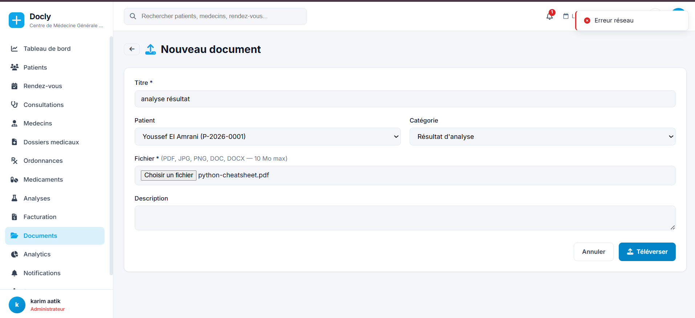
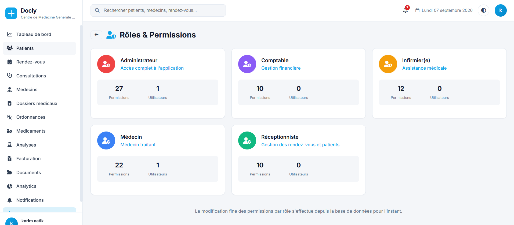

# Docly — Plateforme Multi-Cabinets de Gestion Médicale

**Docly** est une application de gestion clinique complète : patients,
rendez-vous, consultations, ordonnances, médicaments, analyses,
facturation et documents — le tout dans une interface moderne, rapide et
pensée pour l'usage quotidien d'un cabinet médical.

**Architecture multi-cabinets** : plusieurs cabinets peuvent utiliser la
même plateforme, chacun avec ses **propres données**, totalement isolées
des autres. Aucune information ne peut fuiter d'un cabinet à un autre :
l'isolation est garantie au niveau de la connexion aux données, pas par un
simple filtre applicatif.

---

## Tableau de bord

Vue d'ensemble en un coup d'œil à la connexion : statistiques clés,
graphiques d'activité, rendez-vous du jour et raccourcis vers les modules
les plus utilisés. Barre de recherche globale (patients, médecins,
rendez-vous) accessible depuis n'importe quelle page.

## Gestion des patients, rendez-vous et soins

- **Patients** : dossier complet, historique, documents associés
- **Rendez-vous** : planification et suivi de statut
- **Consultations** : compte-rendu, diagnostic, suivi
- **Dossiers médicaux** : antécédents, historique de soins
- **Ordonnances** : rédaction et suivi
- **Médicaments** : catalogue avec **alertes de stock** et
  réapprovisionnement rapide
- **Analyses** : demandes et résultats de laboratoire
- **Médecins** : gestion des praticiens du cabinet

Chaque module dispose du cycle complet **création / modification /
suppression**, avec un bouton **« Historique »** renvoyant vers le journal
d'audit filtré sur l'enregistrement concerné — toujours savoir qui a fait
quoi, et quand.

## Facturation

Détail de facture, historique des paiements, paiement rapide. Par
sécurité comptable, la modification ou la suppression d'une facture est
bloquée dès qu'un paiement y a été enregistré — un avoir peut être émis à
la place, pour ne jamais désynchroniser la comptabilité.

## Documents patients

Chaque document (résultat d'analyse, courrier, pièce administrative...)
est associé à un patient et classé par catégorie, avec titre et
description libres.

*Ajout d'un nouveau document : titre, patient, catégorie, fichier
(PDF, JPG, PNG, DOC, DOCX) et description.*

## Rôles & Permissions

Une grille par rôle (module × action) permet d'autoriser ou de retirer
l'accès à chaque page ou fonctionnalité, sans jamais avoir à toucher à la
base de données. Page réservée aux administrateurs ; les changements
s'appliquent **immédiatement**, y compris aux sessions déjà ouvertes.

*Cinq rôles prêts à l'emploi — Administrateur, Médecin, Comptable,
Infirmier(e), Réceptionniste — chacun avec son propre jeu de permissions
et son nombre d'utilisateurs actifs.*

## Espace plateforme (super-admin)

Un espace dédié permet de superviser l'ensemble des cabinets inscrits sur
la plateforme : liste des cabinets, suspension et réactivation en un
clic. Un cabinet suspendu voit ses utilisateurs déconnectés dès leur
prochaine requête, sans attendre l'expiration de leur session.

## Inscription en libre-service

Un nouveau cabinet peut créer son espace en autonomie : nom du cabinet et
informations de l'administrateur suffisent. La plateforme provisionne
automatiquement l'espace de données du cabinet, ses rôles et permissions
de base, et son compte administrateur — l'utilisateur est ensuite connecté
immédiatement.

## Sécurité

- Mots de passe hachés (bcrypt)
- Jetons CSRF vérifiés sur toutes les requêtes non-GET
- Contrôle d'accès par permission sur chaque page, en plus du contrôle par
  rôle pour l'administration
- Isolation stricte des données entre cabinets
- Protection contre les injections SQL et les failles XSS
- Limitation du nombre de tentatives de connexion
- Journal d'audit complet, par cabinet

## Interface

- **Multilingue** : Français / English / العربية, avec bascule RTL
  automatique pour l'arabe — le choix est mémorisé par utilisateur
- **Barre latérale rétractable** (mode icônes) sur desktop, panneau
  coulissant sur mobile
- **Thème clair / sombre**
- **Design responsive**, adapté à tous les écrans

## Connexion

- **Utilisateurs d'un cabinet** : identifiant du cabinet + email + mot de
  passe
- **Super-admin de la plateforme** : accès dédié pour la gestion des
  cabinets

---

## Licence

Projet de démonstration — usage éducatif et professionnel.
